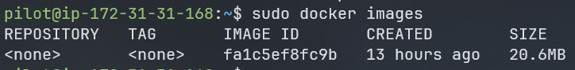
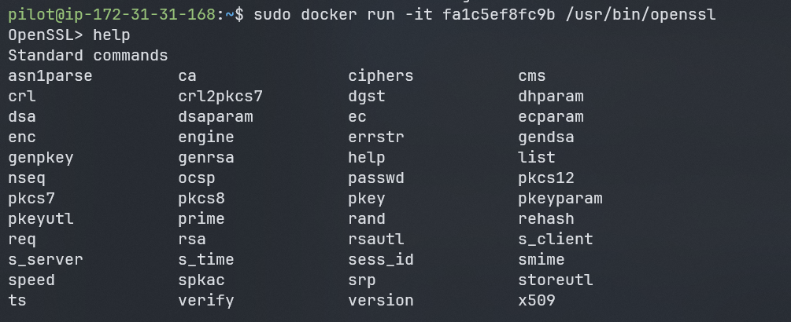
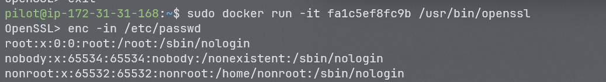
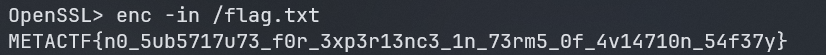

<!-- <font size="5">Into the Skies</font> -->

​	26<sup>th</sup> June 2025

​	Prepared By: CodeBreaker44

​	Challenge Author(s): CodeBreaker44

​	Difficulty: <font color=red>Hard</font>

​	Category: <font color=orange>Misc</font>


# Synopsis 

Escape the Flight Simulator is a MetaCTFv6 challenge that focuses on exploiting a distroless image in a docker container to be able to read files from the container without having a shell access to it.

# Description

To travel is not to escape, Because to escape, one doesn't need to travel far in footsteps, but only further in hope


## Skills required 

* Docker Basics
* Understanding of Distroless Images


## Skills Learned

- Living off the land (LotL) techniques
- Exploiting Distroless images


# Challenge
Challenge Starts by connecting to a machine via ssh using the following creds:
```
username: pilot
password: P!l0t1969
```
after that we are inside a machine that has nothing intersting unless we check for `sudo -l` to see what user pilot can do

we find that it can do the following:

```bash
Matching Defaults entries for pilot on host:
    env_reset, mail_badpass, secure_path=/usr/local/sbin\:/usr/local/bin\:/usr/sbin\:/usr/bin\:/sbin\:/bin\:/snap/bin, use_pty

User pilot may run the following commands on host:
    (ALL) NOPASSWD: /usr/bin/docker run *, /usr/bin/docker ps, /usr/bin/docker images, /usr/bin/docker exec
```

based on this lets check what docker images are available on the machine:

```bash
sudo docker images
```



as we can see there is one image available on the machine.
lets run it and see what we can do with it:

```bash
sudo docker run -it <image-id> sh 
```

but we get this error:

```bash
docker: Error response from daemon: failed to create task for container: failed to create shim task: OCI runtime create failed: runc create failed: unable to start container process: error during container init: exec: "sh": executable file not found in $PATH: unknown
```

this is because the image is a distroless image, which means that it does not contain a shell or any other utilities that we can use to interact with it, so we need to find another way to interact with it.

## Distroless Images exploit

Distroless images are a type of Docker image that contains only the application and its dependencies, without any additional tools or utilities. This makes them smaller and more secure, but also harder to interact with. However, we can still exploit them by using the `docker run` command with the `--entrypoint` option to override the default entrypoint and run a different command.

in order to exploit a distroless image is to try executing commands inside the container but this is not possible cause we don't have a shell inside the container, so we need to find a way to run commands inside the container without a shell.


one attack vector is to benfit from LOtL (Living off the Land) techniques, which means using the tools that are already available on the system to achieve our goal, in this case after some research we find that we can use the `openssl` command to read files from the container, since it is a common tool that is available in most distroless images.

so lets try to read the `/etc/passwd` file using the `openssl` command:

```bash
sudo docker run <image-id> /usr/bin/openssl
```



and yes we are able to execute the `openssl` command inside the container, now lets try to read the `/etc/passwd` file

The exploit 
This abuse leverages the functionality of the enc option, which is commonly used for encryption tasks but, when in the wrong hands, can become a powerful tool for unauthorized access and manipulation of files within the container.

After we open a OpenSSL prompt we can run enc with in option to read a file, let us try printing passwd of this container.



and yes we are able to read the `/etc/passwd` file.

therefore we can read whatever file we want inside the container, so lets try to read the `/flag.txt` file to get the flag:

```bash
sudo docker run <image-id> /usr/bin/openssl enc -in /flag.txt -d
```



and we get the flag:

### FLAG: 
`METACTF{n0_5ub5717u73_f0r_3xp3r13nc3_1n_73rm5_0f_4v14710n_54f37y}`


# Conclusion
In this challenge, we learned how to exploit a distroless image in a Docker container by using the `openssl` command to read files from the container without having a shell access to it. This is a common technique used by attackers to gain unauthorized access to sensitive information within a containerized environment. By understanding how to exploit distroless images, we can better secure our own applications and prevent similar attacks in the future.


#

# References
- [Distroless Images](https://github.com/GoogleContainerTools/distroless)
- [OpenSSL Documentation](https://www.openssl.org/docs/)
- [Docker Documentation](https://docs.docker.com/)

SIC.PARVIS.MAGNA