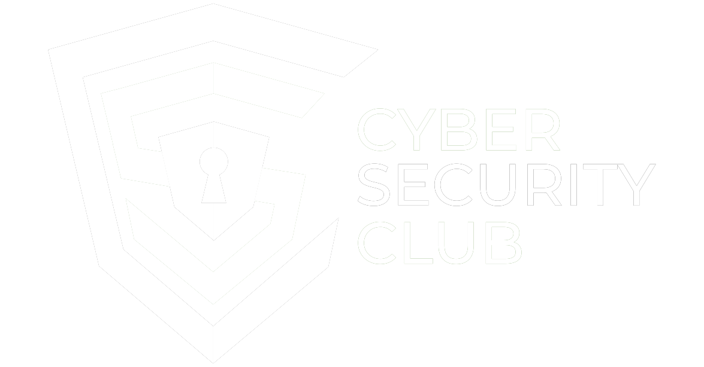
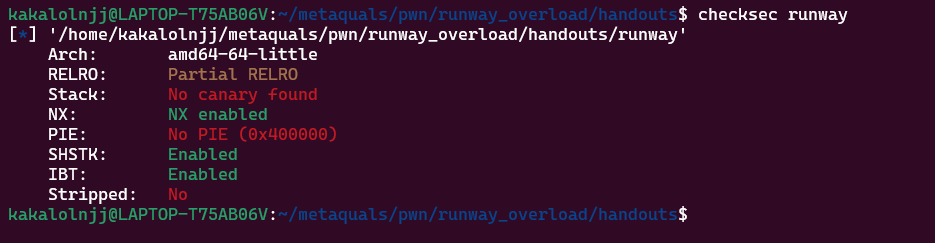
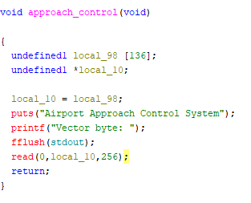
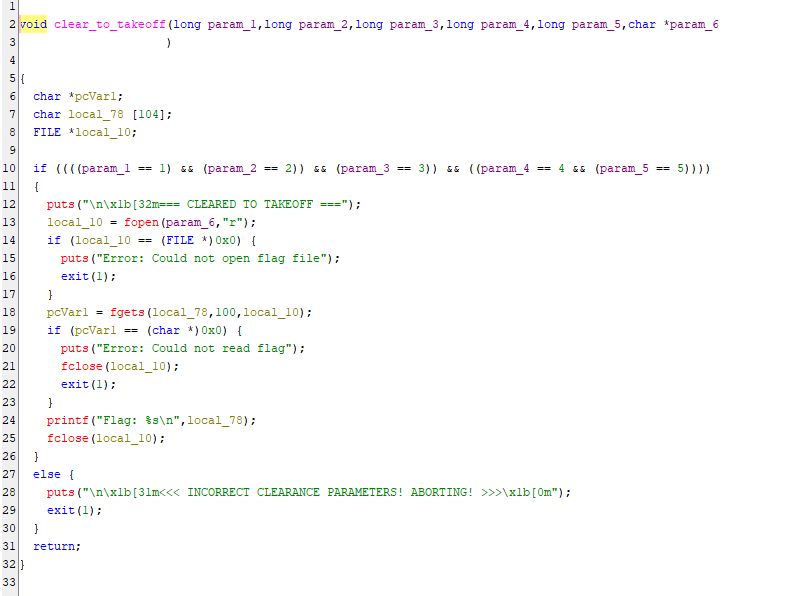
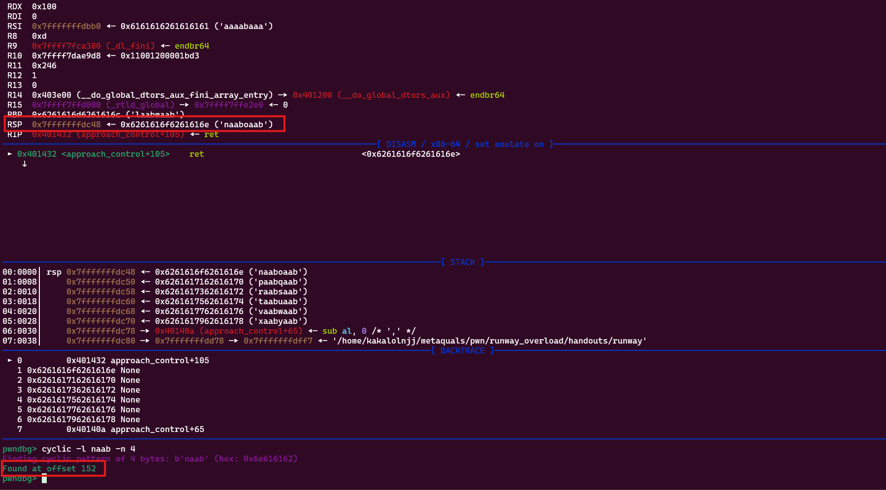
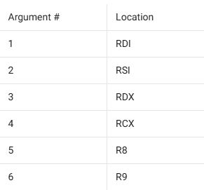
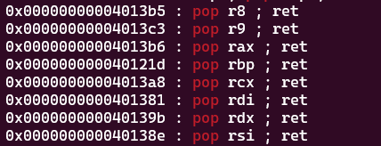
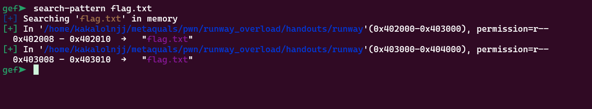
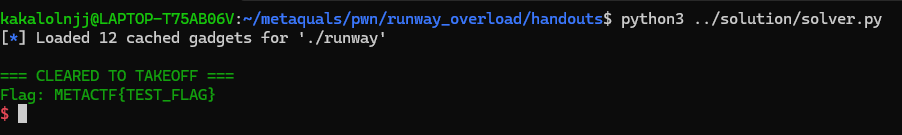

<!-- <font size="5">Into the Skies</font> -->

​	26<sup>th</sup> June 2025

​	Prepared By: kakalolnjj

​	Challenge Author(s): kakalolnjj

​	Difficulty: <font color=Gree>Easy</font>

​	Category: <font color=green>Pwn</font>


# Synopsis 

This challenge is a basic ret2win with parameters challenge . The clear_to_takeoff() function takes 6 parameters and reads the filename provided in the 6th argument.


# Description

Welcome to the METACTF International Airport! Your goal is to safely take-off your exploit by overflowing the runway buffer. Have a nice flight ;)


## Skills required 

* Basic Binary Exploitation knowledge
* Python Scripting (pwntools)
* Reverse Engineering


## Skills Learned

- Understanding calling conventions


# Challenge
Check protections of the binary using `checksec`:


```bash
kakalolnjj@meta_quals:~$ checksec runway
```


as we can see the only protection enabled is `NX` (Non-Executable Stack), which means that the stack is not executable, so we cannot execute shellcode on the stack, but we can still use return-oriented programming (ROP) to execute code.

## Reverse Engineering

Now lets take a look at the binary using `ghidra` 



we can see approach_control() function is called in the main function, there is a very obvious buffer overflow in the read() now let's check if any win function.



we can see that the `clear_to_takeoff()` function takes 6 parameters, the first 5 parameters are integers, and the 6th parameter is a string that is read from a file. This is our `win()` function, we can use this to our advantage to solve the challenge.

## exploit

we need to overflow the buffer and control the return address to point to the `clear_to_takeoff()` function, first let's calculate the offset using gdb:



the offset is 152 bytes .

Let's do a quick google about calling conventions, we can see that the first 6 parameters are passed in registers, and the rest are passed on the stack. 



using `ROPgadget` let's check if usable gadgets are available in the binary:

```bash
kakalolnjj@meta_quals:~$ ROPgadget --binary runway | grep pop
```



great! we have all the gadgets we need, finally we need an address that points to "flag.txt" to read the flag, we can use `gdb` if the string is present in the binary:



the writer was kind enough to leave the string in the binary :) , now we can write our exploit.




Nice !! finally open an instance and solve the challenge remotely

Full Exploit Code: [solver.py](https://github.com/cscpsut/METACTF2025/blob/pwn/runway_overload/pwn/runway_overload/solution/solver.py)


and we get the flag:

### FLAG: 
`METACTF{Dynamic_flag}`


