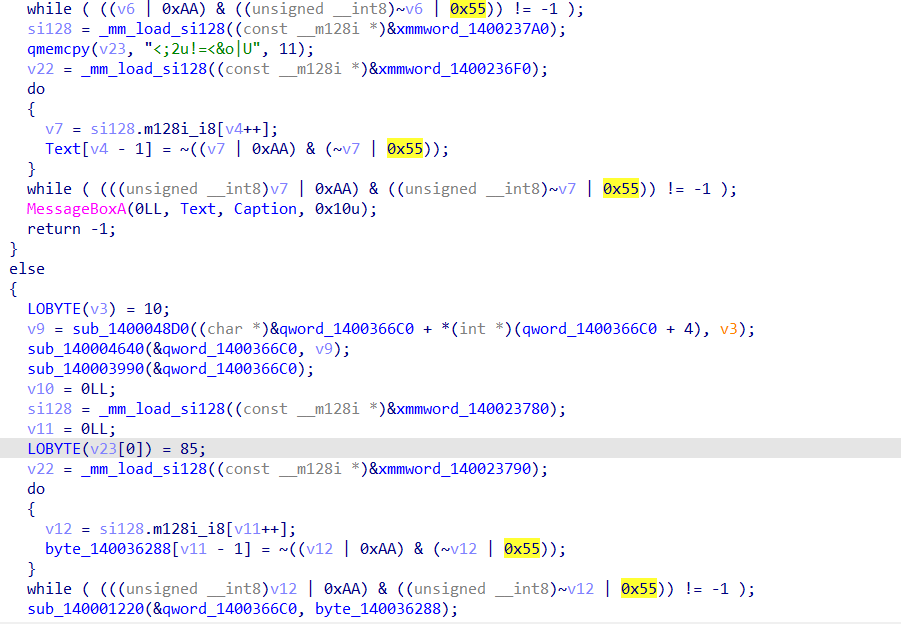
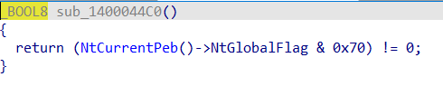
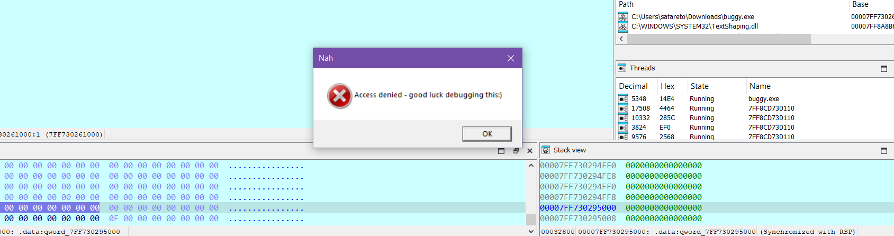
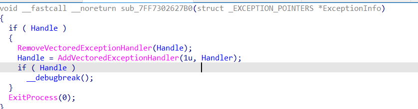
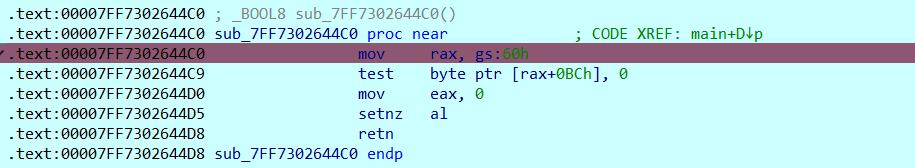
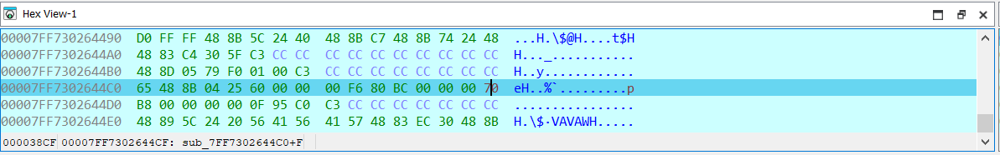
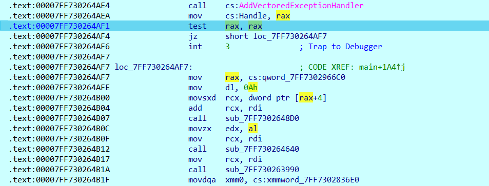

# Buggy Writeup

## Running the challenge
The binary simply asks us to enter the correct flag, not much to gain from running it for now, we'll start by analysing it.

## Static Analysis
Taking a quick look at the the `main` function, we quickly learn that the strings in this binary seem to be obfuscated with bitwise operations as can be seen in this picture, we see this pattern a few times:


This is another form of XORing values together. However, at closer inspection we see that we dont have the obfuscated values, as they seem to be generated on runtime

Diving deeper into the code, we see that it begins with what seems to be an anti-debug mechanism:

This is an old technique used to detect the presence of a debugger using NtGlobalFlag, attaching a debugger doesn't change the value of NtGlobalFlag (which is 0 by default) but it sets the following flags
- FLG_HEAP_ENABLE_TAIL_CHECK (0x10)
- FLG_HEAP_ENABLE_FREE_CHECK (0x20)
- FLG_HEAP_VALIDATE_PARAMETERS (0x40)

The presence of the debugger is detected by checking a combination of these flags:
```asm
mov rax, gs:[60h]
mov al, [rax+BCh]
and al, 70h
cmp al, 70h
jz  being_debugged
```

We quickly intuit that the following code flashes a MessageBox if a debugger was detected, we can verify by setting a breakpoint after the MessageBox call and checking our theory.


The rest of the main function doesn't look very interesting, looks like the program is printing things out, but in the middle there seems to be a weird explicit call to `AddVectoredExceptionHandler` WinAPI function. We'll rotate back to this function later.

We see the params 1 and a function name being passed to it, where we see another call to this function preceded by `RemoveVectoredExceptionHandler` which removes the old exception handler


Clicking on Handler, we see a conditional statement for the result of one function, clicking on it takes us to the real meat of the challenge which seems to be where the flag checking happens.

The decompiled result is a bit big so here are the important things to note:

1. We notice the obfuscated xor pattern again decrypting something
2. Furtherdown, we can see a loop iterating over these bytes (45 to be exact). This seems to be the flag length
3. Classic RC4 decryption pattern that decrypts the buffer (likely the flag)
4. Compares the result with the user input

Clearly this is where the flag checking takes place, but let's take a step back and go back to the AddVectoredExceptionHandler.

The AddVectoredExceptionHandler technique is an anti-debugging method that can detect the presence of debuggers using Vectored Exception Handlers. This technique works by calling AddVectoredExceptionHandler(1, ourHandler) to register a top-level exception handler that will catch any exceptions raised by the process, including those generated by debuggers.

If we take a closer look at how it works in this case:
sub_7FF7302627B0:
- It checks if Handle is valid.
- It removes itself, installs the real handler (Handler), then breaks again.
- Then, calls ExitProcess(0).

Handler:
- Calls the real check function (sub_7FF730262F00) with a global pointer.
- Depending on the return value, calls success or failure handler, then exits.

Which causes a problem since if a debugger is attached, The first handler replaces itself with the real one, then calls __debugbreak(), which triggers int3. But any external debugger will catch INT3 first, not VEH. If a debugger is attached, control will never reach Handler.

And if it does, Handler will ExitProcess(0) quickly. Hence the issue

## Dynamic Analysis
There are 3 main steps here:
1. Bypassing the first anti-debug check

This is easily done by doing the following:


We notice that the value in the hexdump is 0x70 and this means the process is being debugged


We change the value to 0 from 70h and the process continues being debugged normally

After that we will deal with the exception handler. The biggest hurdle is that the VEH handler will receive control as soon as the interruption is manually generated. if the hardware breakpoint is set, the program execution immediately stops. 

There are multiple ways to deal with this issue, the most effective one would be looking at the call stack and hooking the function that moves control from the kernel mode to usermode (usually KiUserExceptionDispatcher). However, something easier would just be modifying the RAX values to zero out


This will be repeated for both exception handlers. there is also patching out both int 3 instructions with NOPs, although I have not tried that.

After that, it is smooth sailing to find the RC4 key generation/flag comparison since memcmp is used. It is a straightforward RC4 implementation.